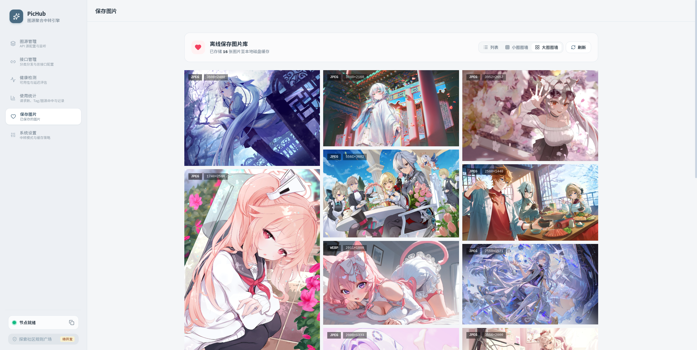
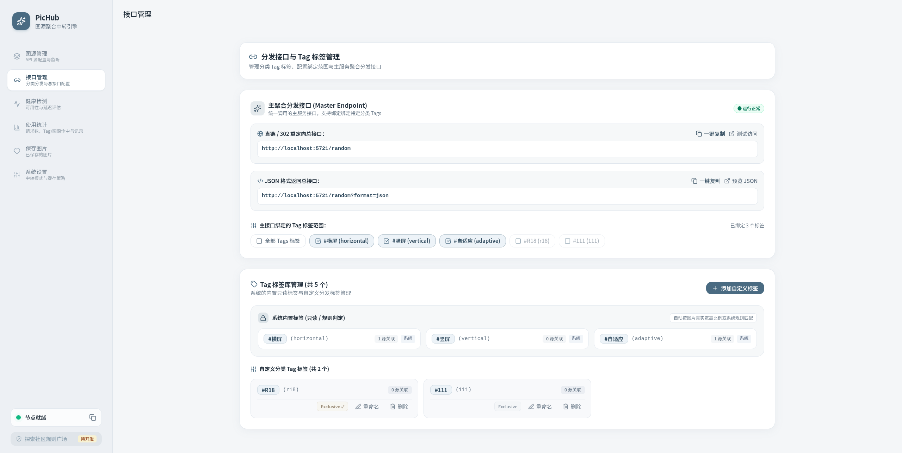
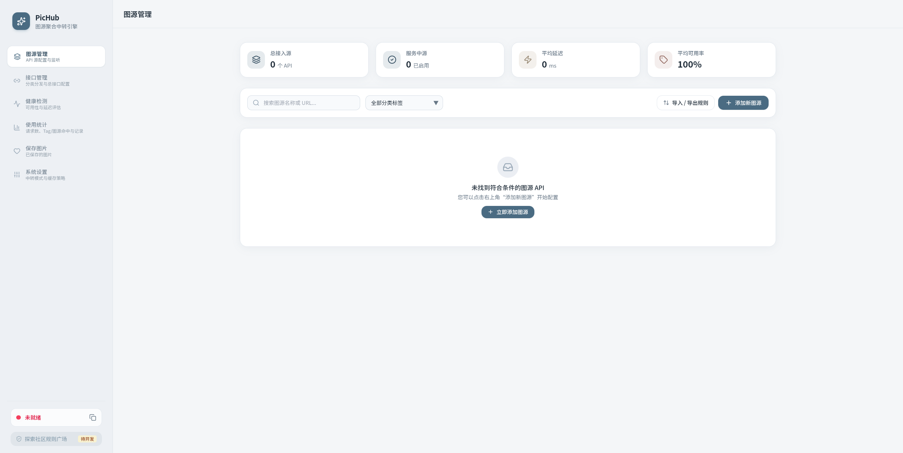
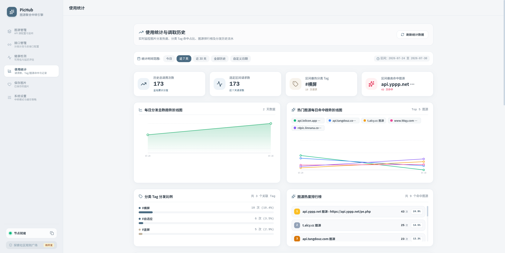

<div align="center">

# PicHub Aggregator

**超高性能、单文件部署的第三方图片 API 聚合分发引擎**

[](https://golang.org)
[](https://vuejs.org)
[](https://tailwindcss.com)
[](https://github.com/untitled572/PicHub-Aggregator/releases)
[](https://www.docker.com)
[](LICENSE)


[快速开始](#-快速开始) •
[核心特性](#-核心特性) •
[控制台预览](#-控制台预览) •
[API 使用指南](#-api-使用指南) •
[项目结构](#-项目结构)

</div>

---

## 🌟 简介

**PicHub** 是一个专为开发者、博客作者与前端应用打造的图片 API 聚合与分发引擎。

它可以将全网散落的各种第三方随机图片 API（包括图片直链、302 重定向、JSON 响应提取等）统一收归管理，对外提供极速、稳定且支持多维度过滤的单分发入口 `/random`。内置现代化 Morandi 风格管理控制台，无需额外部署 Web 服务。

```
		[前端 / Markdown / 博客 / APP]
			          │
			          ▼  GET /random
┌─────────────────────────────────────────┐
│           PicHub 聚合分发引擎             │
│  ┌───────────────────────────────────┐  │
│  │  智能类型解析 | 权重抽选 | 健康降级    │  │
│  └───────────────────────────────────┘  │
└────────────────────┬────────────────────┘
                     │
    ┌────────────────┼────────────────┐
    ▼                ▼                ▼
[二次元 API]    [Unsplash API]   [自建图床 API]
```

---

## ✨ 核心特性

- ⚡ **单文件极简部署**
  Go + Gin 驱动，将打包后的前端页面嵌入至单个可执行二进制文件。无需 Node.js、Nginx 或外部前端环境，单文件/单镜像即开即用。
- 🎯 **多维分类 Tag 与专属分发**
  支持自定义分类 Tag（如默认 `#横屏`, `#竖屏`, `#自适应`）管理。支持为客户端绑定专属 Tag 分发链接，或在 `GET /random?category=tag1,tag2` 中动态多选过滤分发。
- 🏷️ **系统硬编程标签与独占 Tag 隔离**
  内置规则硬编程标签（`#横屏`, `#竖屏`, `#自适应`）独立于【系统内置标签框】中展示；支持 `exclusive: true` 独占隔离标记，仅在客户端显式指定时触发分发。
- 🧩 **多参数与路径衍生分支**
  支持为单个主图源配置参数分支（如 `type=pc`）或独立子 API 链接（如 `/pe.php`）。分支继承主源属性，可单独绑定 Tag 与权重，分发历史流水精确记录轨迹。
- 💾 **本地缓存代理模式**
  支持开启 `proxy_mode` 本地代理缓存。开启后，引擎自动抓取第三方图片并转存至本地磁盘缓存目录 (`./cache`)，对外提供本地 `/images/:file_id` 极速直发与长效 HTTP 缓存。有效解决第三方图源防盗链、跨域限制与源站宕机风险，同时解锁物理宽高检测与离线转存功能。
- 📐 **真图片物理比例动态过滤**
  基于 Go `image.DecodeConfig` 对图片流/缓存文件的真实宽高进行解码检测。在 `proxy_mode=true` 本地代理中转模式下，支持通过 `?orientation=horizontal|vertical` 强制过滤物理真横屏或竖屏图片。
- 👍 **历史流水与权重动态微调**
  提供带图片灯箱预览的分发流水日志，支持对已分发图片一键执行【👍 喜欢 (+1 权重)】或【👎 不喜欢 (-1 权重)】实时调优，可即时优化图源偏好。
- 🖼️ **离线保存图库与图墙**
  支持将喜爱的图片一键本地转存。提供 **列表视图**、**小图展示** 与 **大图图墙** 3 种模式。大图模式取消传统分页栏，采用 **`IntersectionObserver` 无限滚动** 与 **`loading="lazy"` 按需懒加载**。
- 🛡️ **加权随机抽选与自动容错降级**
  内置加权随机抽选算法，支持单次分发最多 3 次（或 8 次）重试。配合后台定期（默认 360 分钟可调）批量健康检测，连续故障图源自动熔断挂起，确保对外分发服务 100% 高可用。

---

## 📸 控制台预览

| 页面 / 功能 | 控制台界面截图 |
| :--- | :--- |
| **大图图墙**<br>• 取消分页栏，采用 `IntersectionObserver` 滚动加载<br>• 自然长方形比例无缝拼接，超大视觉呈现<br>• 一键【下载本地】与取消保存 |  |
| **接口与 Tag 标签管理**<br/>• 独立归集的【系统内置标签框】（横屏/竖屏/自适应）<br/>• 支持独占标签（Exclusive Tag）安全隔离 |  |
| **图源管理库**<br>• 基础信息与 10 ~ 90 权重加权配置<br>• 支持添加子 API 链接与参数分支 Variants |  |
| **使用统计与历史流水**<br/>• 今日/历史 Hits 分发趋势与排行榜<br/>• 历史流水精准缩略图预览与 👍 / 👎 权重实时调优 |  |

---

## 🚀 快速开始

### 方式一：Docker Compose 一键部署 (推荐)

项目已提供 [Docker Compose 配置文件](docs/docker-compose.yml)

```yaml
services:
  pichub:
    image: ghcr.nju.edu.cn/untitled572/pichub-aggregator:latest
    network_mode: host
    volumes:
      - ./data:/app/data
      - ./cache:/app/cache
      - ./pichub_saved:/app/data/saved
    environment:
      - PUID=1000
      - PGID=1000
      - PORT=5721
      - DB_PATH=/app/data/pichub.db
      - CACHE_PATH=/app/cache
      - TRUSTED_PROXIES=127.0.0.1/32
    restart: unless-stopped
```

启动完成后，在浏览器中访问管理控制台：
👉 **http://localhost:5721**

> [`docs/docker-compose.yml`](docs/docker-compose.yml) 使用 `network_mode: host`，容器监听在宿主机 5721 端口。
> 如需自定义端口，可设置环境变量 `PORT` 并修改监听地址。
> 数据持久化在 `./data/`（SQLite 数据库与离线保存库）和 `./cache/`（图片缓存）。

---

### 方式二：使用预构建 Docker 镜像

```bash
docker run -d --name pichub --network host \
  -e PUID=1000 -e PGID=1000 \
  -v ./pichub_data:/app/data \
  -v ./pichub_cache:/app/cache \
  ghcr.io/untitled572/pichub-aggregator:latest
```

---

### 方式三：手动编译构建

#### 1. 编译 Dashboard 前端

```bash
cd dashboard
npm install
npm run build
```

#### 2. 编译并运行 Go 后端

```bash
cd ../backend
go build -o pichub .
./pichub
```

### 方式四：下载release预构建包
---

## 📡 API 使用指南

PicHub 为用户提供统一且极简的调用方式，只需在网页、博客 Markdown 或客户端中调用单个 URL：

### 1. 统一随机图片直链 (Master Endpoint)

```http
GET /random
```
* **说明**：按权重随机抽选可用图源，302 重定向到最终图片（或返回图片流）。

### 2. 按分类 Tag 筛选

```http
GET /random?category=landscape
GET /random?category=avatar,anime
```
* **说明**：仅从包含 `landscape`（风景）或 `avatar,anime`（头像/二次元）标签的可用图源中抽选。

### 3. 按真图片比例过滤 (Orientation Filter)

```http
GET /random?orientation=horizontal
GET /random?orientation=vertical
```
* **说明**：在 `proxy_mode=true` 模式下，基于图片真实宽高比（`image.DecodeConfig`）自动过滤横屏或竖屏图片。

### 4. JSON 数据返回格式

```http
GET /random?format=json
GET /random?category=anime&format=json
```
* **返回示例**：
```json
{
  "url": "https://images.unsplash.com/photo-1506744038136-46273834b3fb",
  "local_url": "/images/a1b2c3d4",
  "source": "Unsplash 高清风景源",
  "categories": ["landscape", "horizontal"],
  "file_id": "a1b2c3d4",
  "width": 1920,
  "height": 1080,
  "format": "jpeg",
  "image_id": 42
}
```

---

## ⚙️ 环境变量配置

支持通过环境变量调整运行参数：

| 环境变量 | 默认值 | 说明 |
| :--- | :--- | :--- |
| `PORT` | `5721` | HTTP 服务监听端口 |
| `DB_PATH` | `./data/pichub.db` | SQLite 数据库文件存储路径 |
| `CACHE_PATH` | `./cache` | 图片缓存目录路径 |

---

## 🛠️ 项目结构

```
PicHub/
├── backend/                  # Go + Gin 后端服务
│   ├── embed/                # 前端静态资源嵌入 (go:embed)
│   ├── handler/              # API 路由处理函数 (Source / Settings / Health / Random / Image)
│   ├── logger/               # 文件日志支持 (200 行轮转)
│   ├── middleware/           # Gin 中间件 (CORS / Rate Limit / Access Log / Admin Auth)
│   ├── model/                # 数据模型与结构体定义 (Source, Tag, Settings, Image)
│   ├── service/              # 核心引擎 (Weighted Pick / Health Checker / Proxy / ImageStore)
│   ├── store/                # SQLite 持久化存储驱动
│   └── main.go               # 主入口
├── dashboard/                # Vue 3 + TypeScript 现代化 Dashboard
│   ├── src/
│   │   ├── components/       # 视图组件 (SourceCard, SourceForm, ParamVariantsModal)
│   │   ├── composables/      # 响应式状态管理 (useApi, useTags, useHealthCheck)
│   │   └── views/            # 核心页面 (Sources, Endpoints, HealthCheck, Settings, Stats, Saved)
│   └── tailwind.config.js    # Morandi 色系主题样式定义
├── screenshots/              # README 控制台预览截图库
├── devdocs/                  # 架构设计与抓取数据流文档
└── docs/                     # API 用户接口文档与 docker-compose 配置
```

---

## 🔗 相关资源

- [随机二次元图片 API 合集](https://blog.air-kevin.rf.gd/2025/random-pix-api-list/?i=2) - 汇总了大量可用的随机图片 API 接口，可作为 PicHub 图源配置的参考来源。

---

## 🤝 贡献与反馈

欢迎提交 Issue 或 Pull Request 来帮助改善 PicHub！
如果 PicHub 对你有帮助，欢迎点亮右上角的 ⭐️ **Star** 予以支持！

---

## 📄 开源协议

本项目采用 [GPL-3.0 License](LICENSE) 协议开源。
